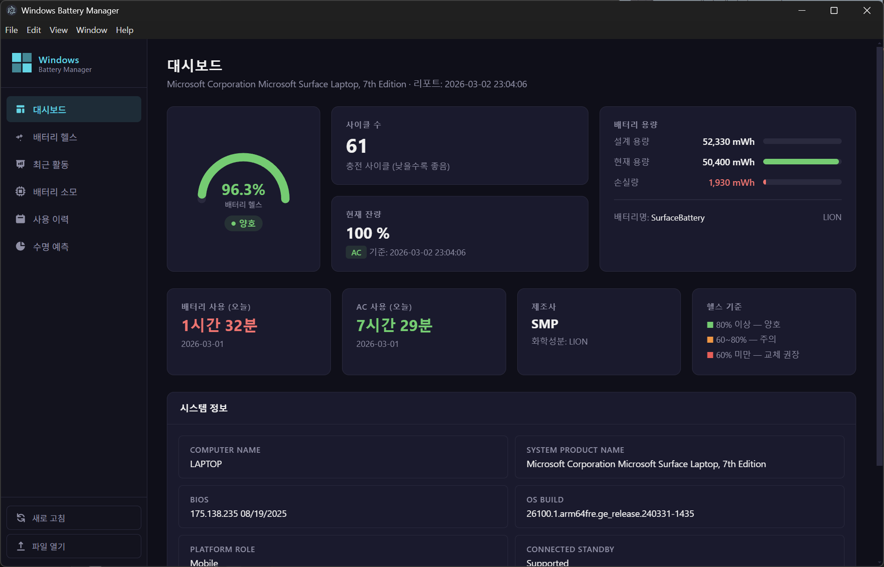
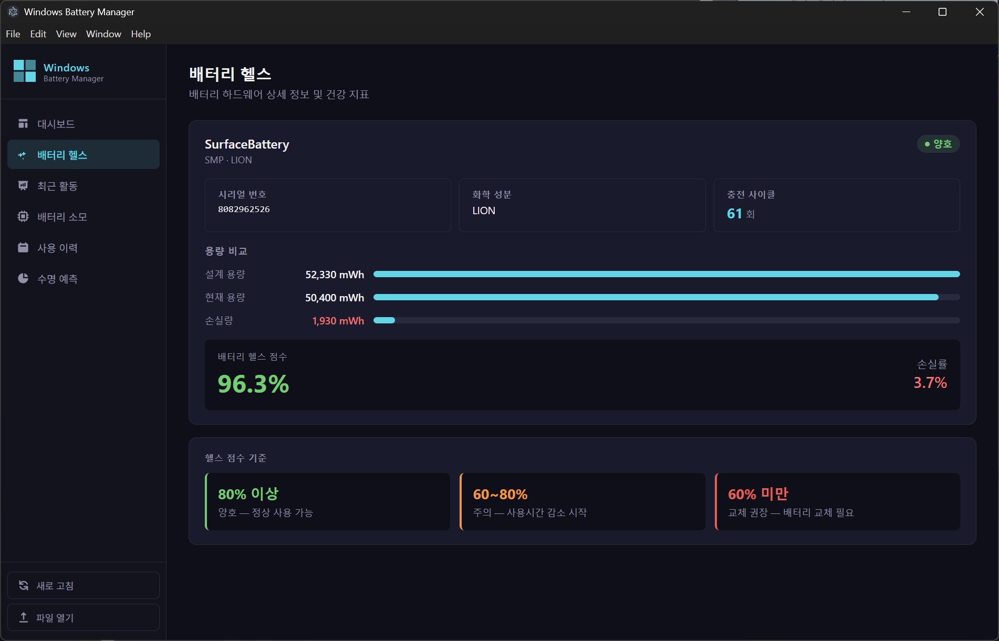
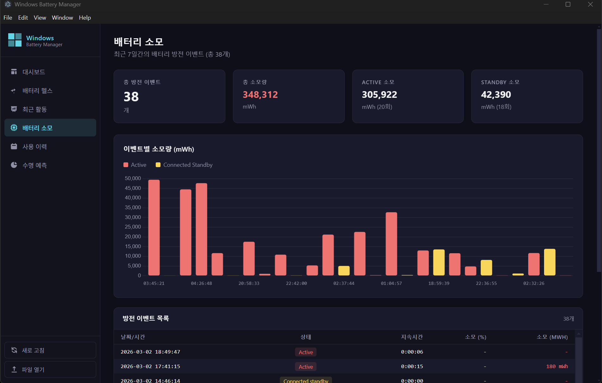
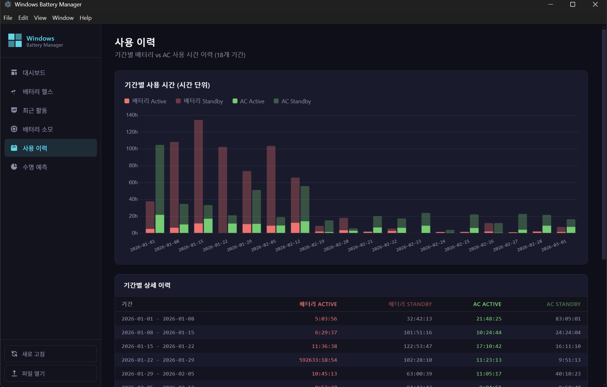
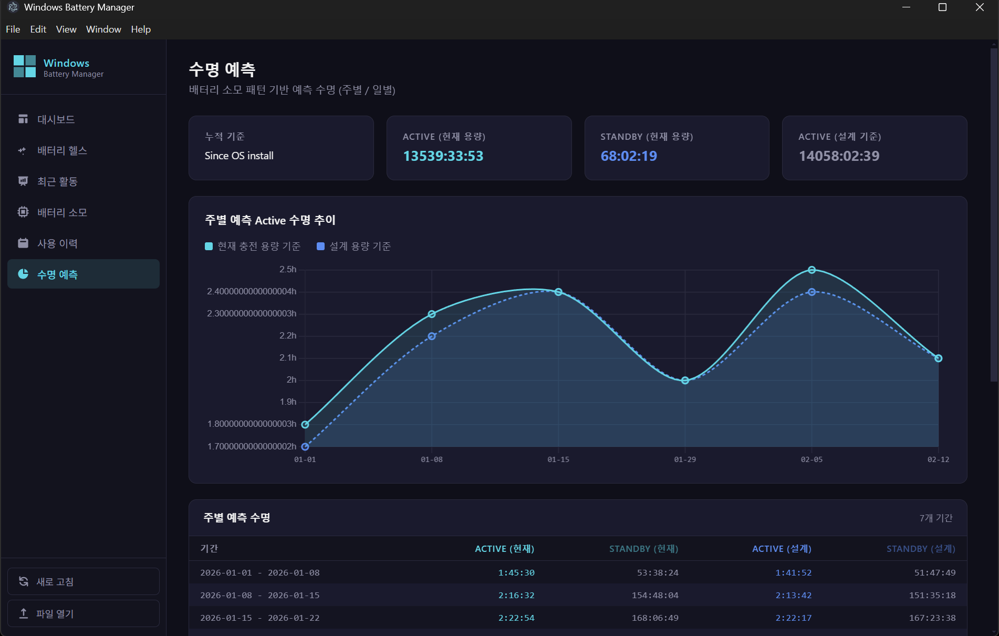

# Windows Battery Manager

<div align="center">



**Windows `powercfg` 배터리 리포트를 시각적으로 분석하는 Electron 데스크탑 앱**

[](https://github.com/x3r0s/windows-battery-manager/releases/latest)
[](https://github.com/x3r0s/windows-battery-manager/releases/latest)
[](https://www.electronjs.org/)
[](LICENSE)

[📥 다운로드](#-다운로드) · [✨ 기능](#-기능) · [🚀 시작하기](#-시작하기) · [🛠 빌드](#-빌드)

</div>

---

## 개요

Windows Battery Manager는 `powercfg /batteryreport` 명령으로 생성되는 배터리 리포트를 파싱하여 배터리 상태를 직관적으로 시각화하는 앱입니다.
배터리 헬스, 충전 사이클, 소모 패턴, 수명 예측까지 한 화면에서 확인할 수 있습니다.

---

## ✨ 기능

### 🖥 대시보드


- **배터리 헬스 게이지** — 설계 용량 대비 현재 용량을 반원 게이지로 표시 (양호 / 주의 / 교체 권장)
- **사이클 수 & 현재 잔량** — 충전 횟수와 현재 배터리 % 및 전원 상태(AC/Battery) 표시
- **용량 시각화** — 설계 용량 / 현재 용량 / 손실량을 비교 바로 표시
- **오늘 사용 현황** — 배터리 사용 시간 vs AC 사용 시간 (가장 최근 기간 기준)
- **시스템 정보** — 제품명, BIOS, OS 빌드, Connected Standby 지원 여부 등

---

### 🔋 배터리 헬스



- 배터리 모델명 / 제조사 / 화학 성분 / 시리얼 번호 상세 정보
- 충전 사이클 횟수
- 설계 용량 · 현재 용량 · 손실량 비교 바
- 헬스 점수(%) 및 손실률(%) 표시

| 헬스 점수 | 상태 |
|-----------|------|
| 80% 이상 | ✅ 양호 — 정상 사용 가능 |
| 60 ~ 80% | ⚠️ 주의 — 사용 시간 감소 시작 |
| 60% 미만 | ❌ 교체 권장 — 배터리 교체 필요 |

---

### ⚡ 최근 활동

- 최근 7일간 전원 상태 전환 로그 (Battery / AC 전환 기록)
- **배터리 잔량 추이 차트** — 최근 200포인트 라인 차트, AC/Battery 구간 색상 구분
- 이벤트 로그 테이블 (날짜·시간 / 상태 / 전원 / 잔량 % / 잔량 mWh)

---

### 🔥 배터리 소모



- 최근 7일간 방전 이벤트 요약 (총 소모량 / Active 소모 / Standby 소모)
- **이벤트별 소모량 바 차트** — Active(빨강) / Connected Standby(노랑) 색상 구분
- 방전 이벤트 목록 테이블 (날짜·시간 / 상태 / 지속시간 / 소모 % / 소모 mWh)

---

### 📊 사용 이력



- 기간별 배터리 Active/Standby vs AC Active/Standby 사용 시간 이력
- **스택 막대 차트** — 각 기간의 전원 사용 패턴을 한눈에 비교
- 기간별 상세 테이블 (배터리 Active / 배터리 Standby / AC Active / AC Standby)

---

### 🔮 수명 예측



- 배터리 소모 패턴을 기반으로 한 주별 예상 수명 계산
- **현재 충전 용량 기준** vs **설계 용량 기준** 수명 동시 비교
- 주별 예측 수명 추이 라인 차트
- 기간별 ACTIVE / STANDBY 예측 수명 상세 테이블

---

## 📥 다운로드

**[최신 릴리즈 → Releases 페이지](https://github.com/x3r0s/windows-battery-manager/releases/latest)**

| 파일 | 설명 |
|------|------|
| `WindowsBatteryManager-Setup-x.x.x-x64.exe` | NSIS 인스톨러 (권장) |
| `WindowsBatteryManager-Portable-x.x.x-x64.exe` | 포터블 — 설치 없이 바로 실행 |

---

## 🖥 시스템 요구사항

- **OS:** Windows 10 / Windows 11 (x64)
- **권한:** 관리자 권한 권장 (`powercfg` 자동 실행 시 필요)
- 배터리가 있는 노트북/태블릿 PC (데스크탑은 배터리 정보 없음)

---

## 🚀 시작하기

### 인스톨러 버전

1. [Releases](https://github.com/x3r0s/windows-battery-manager/releases/latest)에서 `Setup` 파일 다운로드
2. 설치 후 시작 메뉴 또는 바탕화면에서 **Windows Battery Manager** 실행

### 포터블 버전

1. [Releases](https://github.com/x3r0s/windows-battery-manager/releases/latest)에서 `Portable` 파일 다운로드
2. 파일 직접 실행

### 사용법

1. 앱 실행 후 **"새로 고침"** 버튼 클릭
2. `powercfg /batteryreport`가 자동 실행되어 리포트 생성 및 분석
3. 사이드바에서 원하는 뷰 선택 (대시보드 / 배터리 헬스 / 최근 활동 / 배터리 소모 / 사용 이력 / 수명 예측)

> 기존에 저장된 배터리 리포트 HTML 파일이 있다면 **"파일 열기"** 버튼으로 직접 불러올 수 있습니다.

---

## 🛠 빌드

### 요구사항

- [Node.js](https://nodejs.org/) 18 이상
- Windows 환경 (electron-builder 빌드 타겟이 win32)

### 개발 환경 설정

```bash
git clone https://github.com/x3r0s/windows-battery-manager.git
cd windows-battery-manager
npm install
npm start
```

### 배포용 빌드

```bash
# NSIS 인스톨러 + 포터블 동시 빌드
npm run build

# 포터블만 빌드
npm run build:portable
```

빌드 결과물은 `dist/` 디렉토리에 생성됩니다.

---

## 🌿 브랜치 전략

| 브랜치 | 용도 |
|--------|------|
| `main` | 보호된 브랜치 — 직접 push 불가, PR을 통해서만 머지 |
| `dev` | 개발 작업 브랜치 — 모든 신규 작업은 이 브랜치에서 시작 |

---

## 🤝 기여

1. `dev` 브랜치에서 feature 브랜치 생성
2. 작업 후 `dev`로 PR
3. `dev` → `main` PR로 최종 반영

---

## 📄 라이선스

MIT License — 자유롭게 사용, 수정, 배포 가능합니다.
